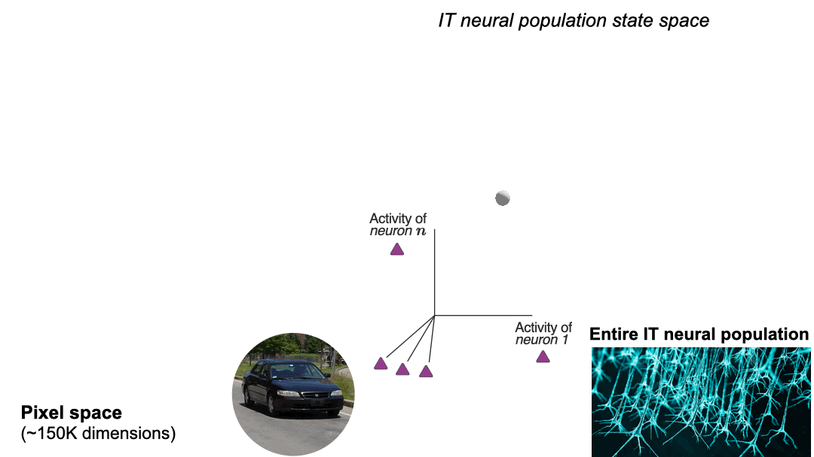
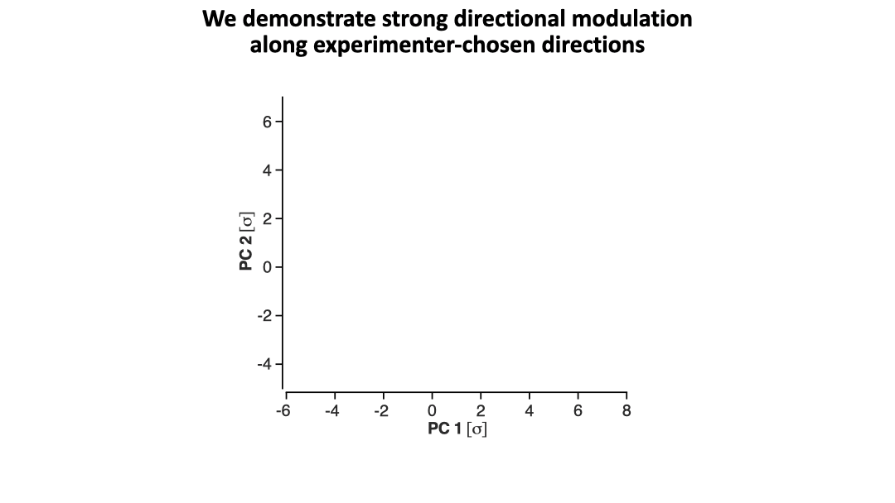
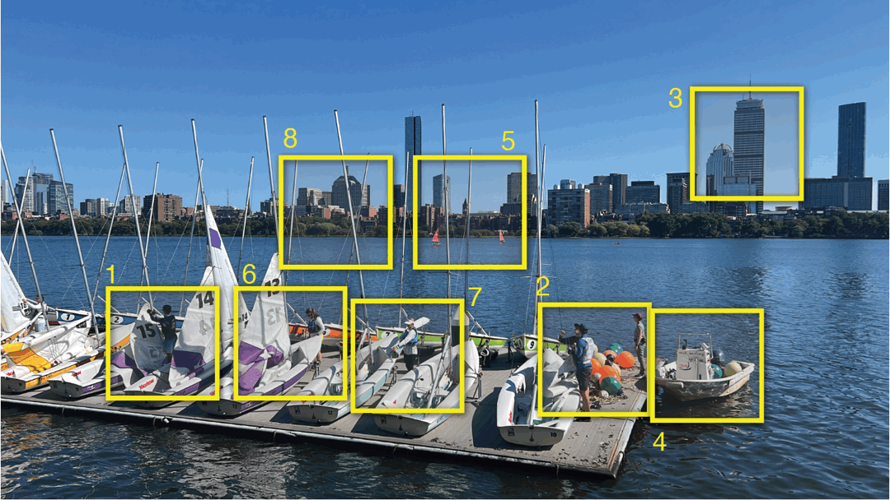

# Noninvasive precision modulation of high-level neural population activity via natural vision perturbations

  

   

  

 

  

### ***Official implementation & data for:***
> **Noninvasive precision modulation of high-level neural population activity via natural vision perturbations** \
> Guy Gaziv, Sarah Goulding, Ani Ayvazian-Hancock, Yoon Bai, James J. DiCarlo
> 
> **TL;DR**  
> In this work we develop and apply a new framework to explore the possibility of noninvasive, precise neural activity modulation in deep brain regions via perturbations that could be applied to ongoing natural visual feeds. We then test this approach in macaque inferior temporal (IT) neural sub-populations and demonstrate successful injection of experimenter-chosen neural modulation patterns.

# Code coming soon